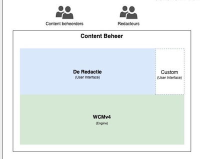
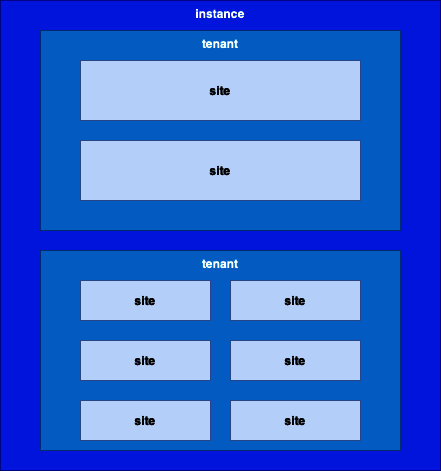
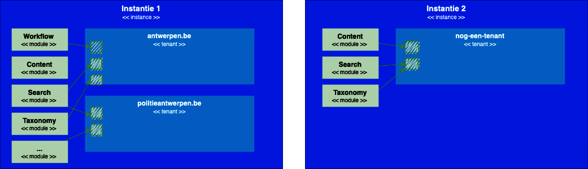
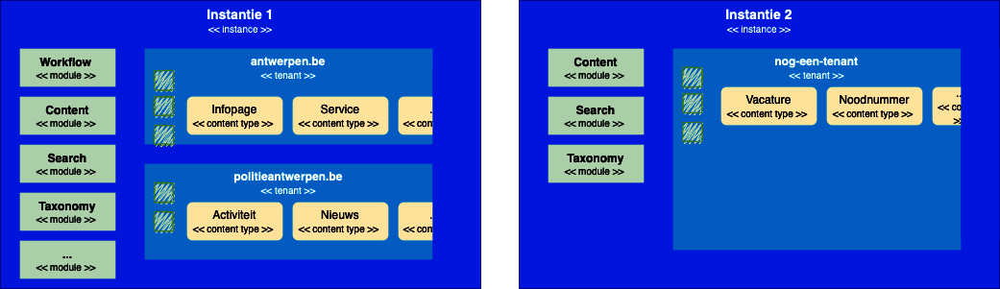
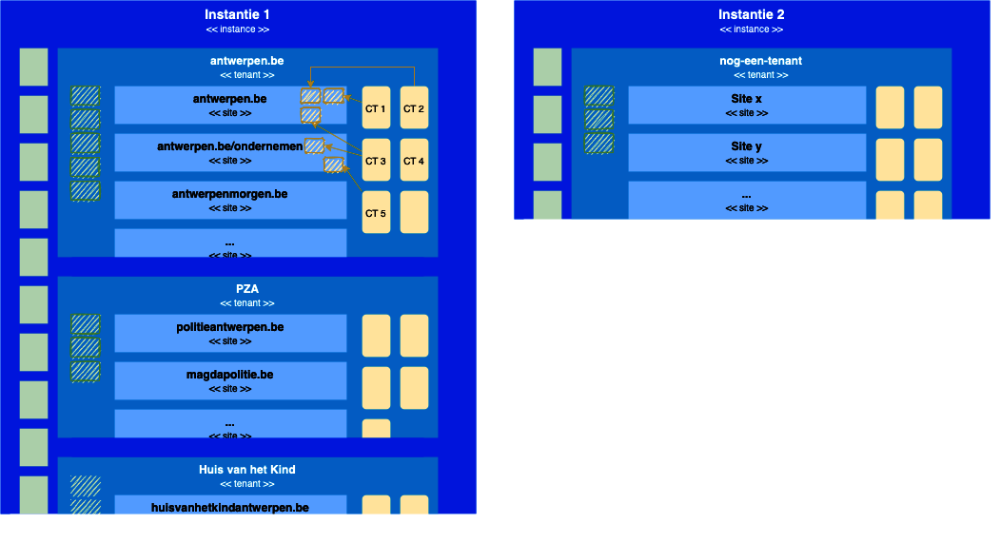
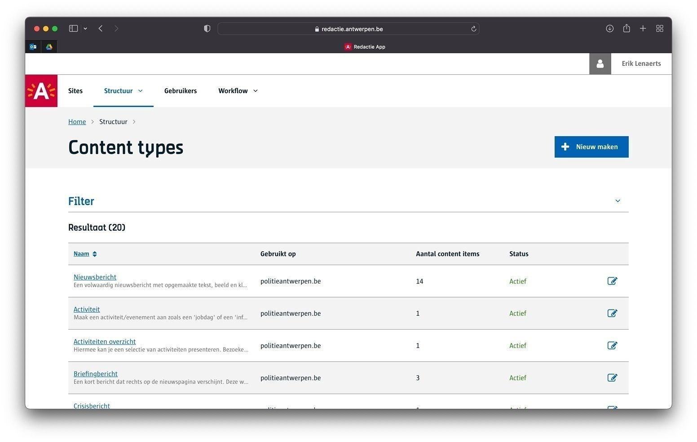
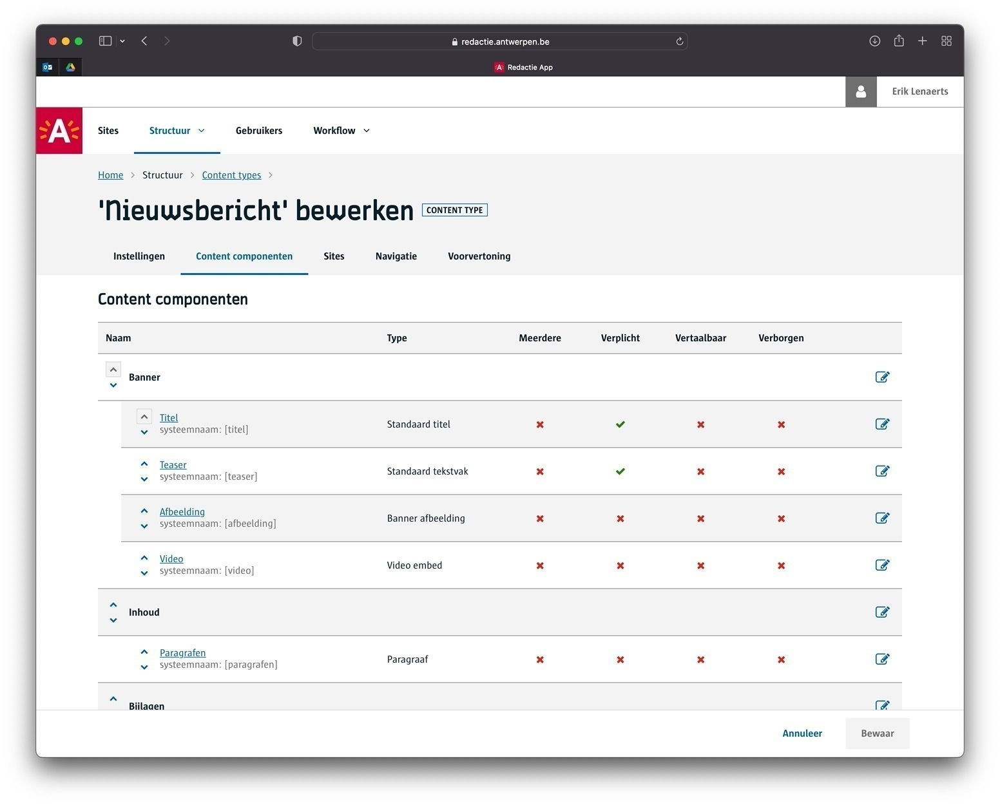
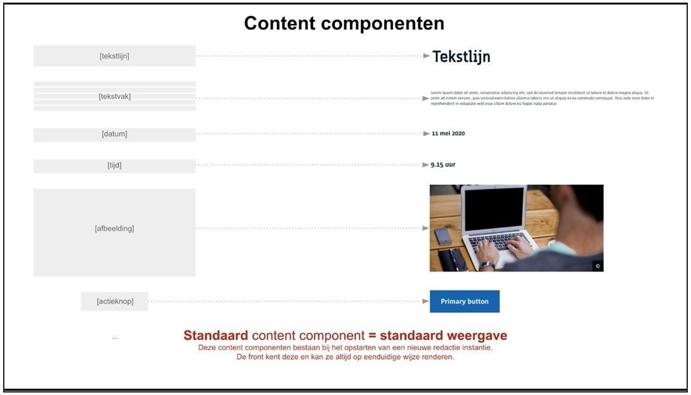

# GPubP Content 

Lees [hier een intro](/content/gpubp.md) van GPubP en GPubP Content

# GPubP Content

Het Content beheer Bestaat uit de Redactie omgeving, zeg maar de User interface waarin Content Beheerders een inrichting doen én waarin redacteurs de effectieve Content Items beheren volgens die inrichting.

> [!note]
> Je kan de Redactie bereiken via [https://redactie.antwerpen.be <i class="fa-solid fa-xs fa-arrow-up-right-from-square"></i>](https://redactie.antwerpen.be ':target="_blank"')

# Modulaire opbouw

De WCMv4 & Redactie zijn bijzonder modulair, heel het systeem is een reeks modules die onderling samenwerken. Hieronder beschrijven we er meer van in de architectuur. Het voordeel van z’n modulair systeem is dat je in verschillende situaties, verschillende combinaties van modules kunt opzetten. Zo kunnen we uiterste flexibiliteit nastreven, mede doordat het redactie/WCMv4 specifiek multi-instance, multi-tenant en multi-site eigenschappen bevat.

> [!tip]
> Wil je mee werken aan het platform? Bekijk dan zeker de [contributie docs <i class="fa-solid fa-xs fa-arrow-up-right-from-square"></i>](https://gpubp.github.io/docs_wcm_contributor/#/ ':target="_blank"').

# Multi - instance, - tenant, - site

Om de grote hoeveelheid aan sites te organiseren en structureren zijn er 3 niveaus. 

1. Instance
2. Tenant
3. Site

Hieronder lees je meer over deze 3 concepten. Doorheen de hele documentatie gebruiken we deze termen regelmatig, best dat je ze goed begrijpt wanneer je aan de slag gaat met het GPubP Content Beheer.

### Multi-instance

Een instantie is een volwaardige deployment van het systeem. Momenteel is er één instantie van het GPubP op Digipolis infrastructuur. We sluiten niet uit dat er voor specifieke vereisten er nog instantie naast gezet kan worden. 

> We gebruiken de term *installatie* ook wel eens door elkaar met *instantie*.

Alle functionaliteiten van het systeem zitten in Modules. Zonder deze modules is de WCM een lege doos. Modules worden geïnstalleerd bij een instantie zodat ze daar beschikbaar zijn voor de tenants. Elke instantie heeft op die manier z'n eigen lijst van geïnstalleerde modules.

!> In de afbeeldingen hier tekenen we 2 instanties bij wijze van voorbeeld, in de praktijk is er slechts één instantie bij Digipolis.

### Multi-tenant

Elke installatie kan logisch opgedeeld worden in tenants. Elke tenant is een afgescheiden geheel waarin content gescheiden is. Maw, redacteurs die in één tenant werken kunnen niet aan content werken uit een andere tenant, tenzij natuurlijk dat ze hier ook de rechten voor hebben. In het voorbeeld hieronder heb ik rechten op 2 verschillende tenants als gebruiker. (Ik vermeld momenteel nog even gebruiker, straks gaan we dieper in op de rollen van het systeem)

Belangrijk om te vermelden is dat je per tenant kan kiezen welke modules je gaat hanteren. Dit is de lijst van geïnstalleerde [WCM modules <i class="fa-solid fa-xs fa-arrow-up-right-from-square"></i>](https://gpubp.github.io/docs_wcm_contributor/#/content/wcm-modules ':target="_blank"') voor de instantie die we hosten op het datacenter van Digipolis. In tenant één maken we alle modules beschikbaar, in tenant twee enkel 6 modules. Wil je echter één module anders inzetten (dus het gedrag veranderen door het anders te configureren), dan richt je best verschillende instanties in.

**Content Types**, **Content Blokken** en **Content Componenten** zijn allemaal Tenant specifiek, maw, ze gelden voor de hele tenant.

### Multi-site

Elke tenant bestaat op zijn beurt uit één of meerdere sites. Sites, zijn net zoals tenants een logische opdeling voor de content. Wat is dan het verschil tussen een tenant en een site zal je wellicht je afvragen? Als ze beide de content scheiden… het antwoord is consistentie ;). Op het moment dat we een tenant gaan inrichten, definiëren we hoofdzakelijk content types en content componenten, zeg maar de structuur van de content (meer daarover hieronder). Alle sites binnen één tenant kunnen deze structuren delen, met andere woorden, eenzelfde set van content componenten, content blokken en content types worden consistent over alle sites van een tenant gebruikt. 

Een content type of een content blok *geactiveerd* moet worden in een site. Anders gaat ze daar niet bruikbaar zijn. Zo zullen in de praktijk bepaalde content types enkel in één site geactiveerd worden en andere content types op misschien meerdere andere sites.

# Content Types

Een Content Type is de essentie van elk CMS, ook dat van het GPubP. Het is definitie, een sjabloon, een blauwdruk waarmee redacteurs content items maken. 

Stel, je wil een nieuws artikel tonen op je website. Dit artikel bestaat op zich uit:

* Een titel
* Een introductietekst
* De inhoud
* Een sfeerbeeld
* Enkele tags.

In plaats van dit allemaal als één doorlopende tekst te beschouwen, gaan we dit te structureren in aparte delen. Zo kan de frontend bijvoorbeel de <code>titel</code> in grotere weergavestijl tonen dan de <code>inhoud</code>. Met dit voorbeeld is “nieuwsartikel” een Content Type dat opgebouwd wordt met verschillende Content Componenten. 

> [!Tip] 
> Ingeval er veel content componenten zijn, kan je deze verdelen over *compartimenten*, zo blijft het overzichtelijk voor de redacteur om content items in te voeren.

De figuur hieronder geeft een lijst van de content types op de PZA tenant:

Eerder beschreven we dat content types op tenant niveau worden gemaakt, in de bovenstaande figuur kan je zien op waar (sites) de content types *geactiveerd* zijn.

Hieronder zie je een voorbeeld van een Nieuwsbericht content type en welke content componenten we daarvoor hebben gedefinieerd.

Zoals je ziet bestaat een content type op zich uit content componenten. Het geheel is dus het sjabloon dat je aan de redacteurs aanbiedt.

# Content Blokken

Content types en content blokken liggen heel dicht bij elkaar, ze delen quasi 99% van de eigenschappen met elkaar. Beide zijn sjablonen voor het maken van content items. Het subtiele verschil is:

Content items gemaakt obv een ...

| Content Type                                                    | Content Blok                                                      |
|:----------------------------------------------------------------|:------------------------------------------------------------------|
| ...worden gebruikt voor **een volledige pagina** in de frontend | ...worden gebruikt voor een **deel van de pagina** in de frontend |
| ...hebben link waardoor je in de frontend er naar kan navigeren | ...hebben geen link, je kan er niet naar navigeren.               |
| ...kunnen gebruikt worden in een menu                           | ...kunnen **niet** gebruikt worden in menu                        |
| ...kunnen een plaats hebben in de sitestructuur                 | ...hebben **geen** plaats in de sitestructuur                     |

Er zijn een 2 typische use cases waarvoor je content blokken gaat inzetten:

1. je wil een stuk content opmaken dat op verschillende plekken kan hergebruikt worden
2. je wil content aanmaken dat op zich geen eigen detailpagina heeft, maar eerder voorkomt in een opsomming/lijst van een andere pagina. 
   bv. in een help pagina tonen we FAQ items wat bestaat uit een vraag en antwoord. Het is voldoende om deze in een lijst op de hulp pagina te tonen, er moet niet naar een individueel FAQ item gesurft kunnen worden.

# Content Componenten

Als je aan een redacteur vraagt om een nieuwsartikel te maken, dan stel je haar/hem een scherm voor waarin hij/zij de verschillende onderdelen van het nieuwsartikel kan invoeren. Een titel, een intro, etc. deze onderdelen zijn voorbeelden van content componenten.

