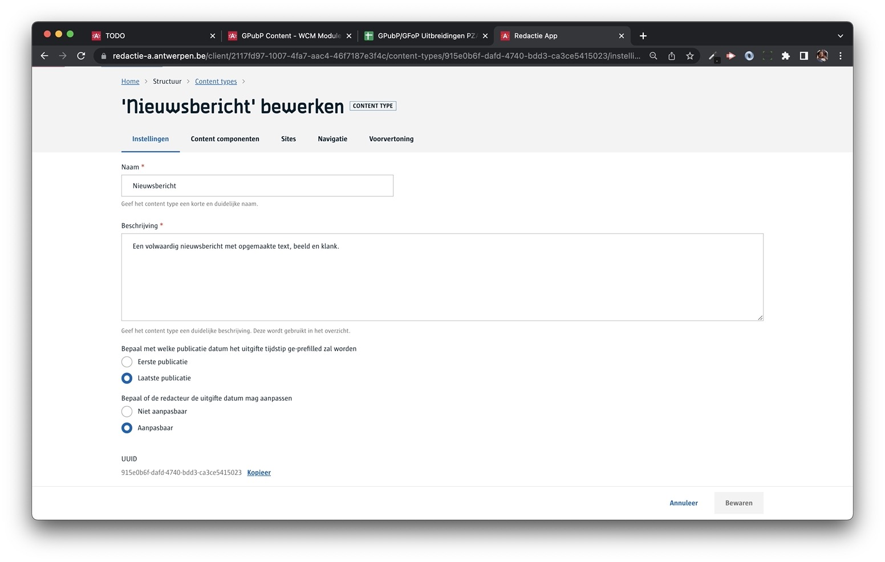

# Content life cycle

## Basis life cycle
Elk content item heeft een *publicatie status*, deze geeft aan waar het content item zich in z'n levenscyclus bevindt. 

> [!note|label:Basis content life cycle]
> In essentie komt het hier op neer:
> 
> **nieuw** > **werkversie**(s) > **gepubliceerd** > **gearchiveerd** 

1. Je maakt een **nieuw** content item, je bewaart het als een **werkversie**,
2. je sleutelt aan één of meerdere **werkversies** die je op een gegeven moment **publiceert** om het vrij te geven aan afnemers
3. op het einde **archiveer** je het content item waardoor het niet meer beschikbaar is voor afnemers.


Wanneer je het content item ophaalt zal je de status terugvinden in het meta luik.

```json
    ...
    meta {
        ...
        "status": "DRAFT",
        ...
    }
    ...
```

## Online vs Offline

> [!note|label:hoe werkt het]
> Een content item is online van ... 
> * zodra het **gepubliceerd** is 
> 
> en het zal online blijven ... 
>
> * zolang het niet **gearchiveerd** wordt
> * zolang er geen **nieuwere publicatie** is
>
> nieuwere werkversies hebben geen invloed op eerder gepubliceerde versies voor afnemers 


Als je de data van een content item ophaalt staat er in het meta deel of het content item online of offline staat via het <code>published</code> attribuut. 

```json
    ...
    meta {
        ...
        "published": true,
        ...
    }
    ...
```


## Een recentere werkversie ?
Dit is een meer realistisch voorbeeld waarbij een content item verschillende keren wordt bijgewerkt en gepubliceerd wordt. In het blauw duiden we aan wat een afnemer ziet op punten 1, 2, 3 en 4, nl:

1. er is nog nooit een versie gepubliceerd, de afnemer kan dit content item niet ophalen (een '404')
2. er is een gepubliceerde versie (v2) dit krijgt de afnemer te zien, ondanks dat er al een nieuwere werkversie beschikbaar is.
3. versie 5 heeft de voorgaande gepubliceerde versie vervangen, deze staat nu online
4. de redacteur heeft het content item geachiveerd, bijgevolg is het offline


Als je de data van een content item ophaalt staat er in het meta deel of het content item online of offline staat via het <code>published</code> attribuut. 

In het meta luik van een content item kan je verschillende datums opvragen om meer inzicht te krijgen in de versie geschiedenis. 

```json
    ...
    meta {
        ...
        "created": "2022-03-11T11:40:54.941Z",
        "firstPublished": "2022-03-11T11:41:02.310Z",
        "lastModified": "2022-04-20T07:43:13.586Z",
    }
    ...
```

Via de redactie kan je ook de versie geschiedenis bekijken, hiervoor heb je wel de [Revisies module](https://gpubp.github.io/docs_wcm_contributor/#/content/wcm-modules) nodig. Open hiervoor een content item en ga naar de *Revisies* tab.


## Standaard statussen
Het systeem kent de volgende standaard statussen. 

* **Nieuw**
: Dit is de eerste status bij het aanmaken van een content item
* **Werkversie**
: De wijzigingen worden opgeslagen, maar staan nog niet online.
* **Klaar voor nakijken**
: Het content item staat klaar voor de volgende om ne te kijken. 
* **Klaar voor publicatie**
: Het content item staat klaar om te publiceren door iemand die er rechten voor heeft. 
* **Gepubliceerd**
: Het content item is gepubliceerd en verschijnt online.
* **Gearchiveerd**
: Het content item wordt offline gehaalt.

Dit is voor de meeste gevallen voldoende. Merk op dat je eigen custom statussen kan maken, dit is vooral handig als je met specifieke [workflows](/content/redactie/workflows.md) aan de slag gaat.

## Scheduling
De redactie heeft een functionaliteit om het één en ander in te plannen.

Hiervoor ga je naar het content item en open je het *Planning* compartiment. Je kan zowel de **publicatie** als de **archivering** inplannen.


Aan de data kan je aan de volgede attributen zien of een content item gepland is om te publiceren en/of te archiveren:

```json
    ...
    meta {
        ...
        "publishTime": "2022-04-21T22:00:00.000Z",
        "hasScheduled": true,
        "unpublishTime": "2022-04-22T22:00:00.000Z",
    }
    ...
```
## Uitgifte tijdstip
De meeste afnemers presenteren de publicatie tijdstip op hun pagina's als tijdstip wanneer de content online is gekomen. Toch zijn er situaties waarin je zelf als redactuer dit wilt instellen van jouw content item. 

> **Voorbeeld:** Stel je wil nieuwsberichten van de oude site overzetten en ze presenteren met het tijdstip waarin ze vroeger gepubliceerd zijn. 

Hiervoor hebben we een apart *uitgifte tijdstip* dat je als redacteur kan instellen. Een [content beheerder](/content/redactie/onboarding?id=standaard-rollen) kan het gedrag van deze uitgifte tijdstip inrichten. Zo kan er gekozen worden voor:

* Bepaal de default waarde van de uitgifte tijdstip, nl. eerste - of laatste publicatietijdstip
* Bepaal of de redacteur de uitgifte datum kan aanpassen of niet 



Bij het ophalen van de data kan je het uitgifte tijdstip zo terug vinden:

```json
    ...
    meta {
        ...
        "issuedOn": "2022-03-11T11:41:02.310Z",
    }
    ...
```
